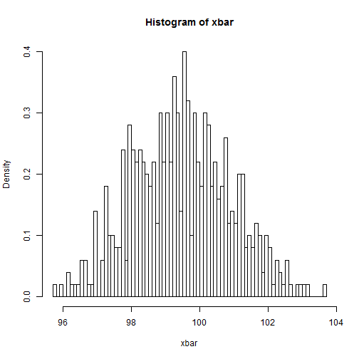

## Summary
This is a shiny app that tests the theory of the central limit theorem. 
The app gives you the ability to play around with the relevant variables
of a probability distribution and shows how this feeds into the CLT.

--- .class #id 

## Description

# What is the central limit theorem
The central limit theorem states that from a probability distribution (which doesn't have to be 
normally distributed), if you take samples of a specified number (n) and find the means of these samples,
the distribution of these means will be normally distributed. 

There are many theories where this can be proved but it is also something that can be observed 
practically. 

--- .class #id 


## How it is done
The variables that are used are relevant to the original distribution and the samples that are 
drawn from it. 

They are:

 - Population Mean 
 - Population Standard Deviation
 - Sample Size - the number of draws in the sample. For example if there is a population of 100 we will draw 3 items.
 - Number of trials - The number of times you draw the sample. 
 
The resulting histogram will be a function of all the variables above. Changing any one of the variables will
change the histogram. The curve, or lack thereof, the histogram is determined by the last 2 variables. 

--- .class #id 


## The Code
The same code used to create the published histogram is given below. Please run it and enjoy!


```r
mu=100
sigma=10
n = 50
numTrials = 500
xbar=rep(0,500)
for(i in 1:numTrials){xbar[i] = mean(as.integer(rnorm(n, mean=mu, sd=sigma)))}
hist(xbar, prob=TRUE, breaks=100)
```

 
