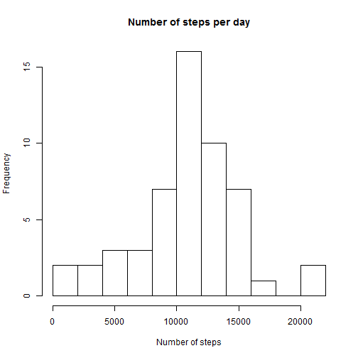
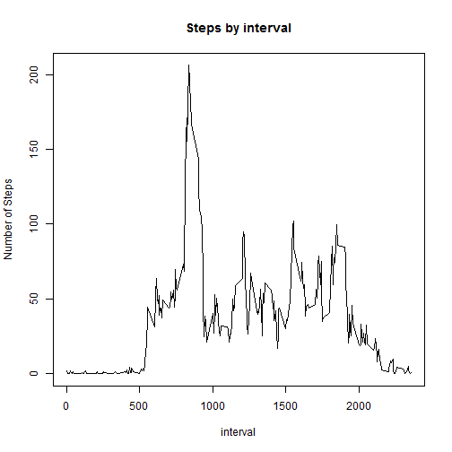
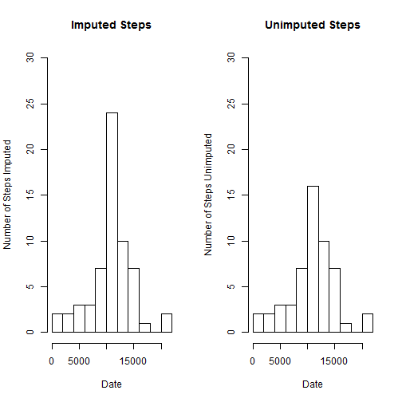
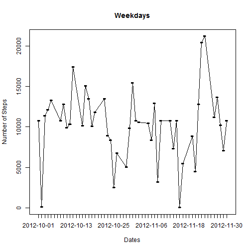
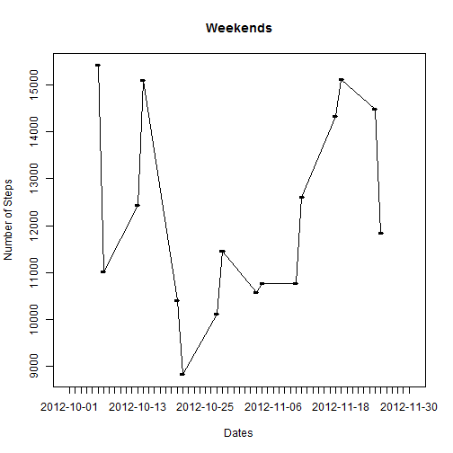

## Loading and preprocessing the data

```r
setwd("C:\\Users\\Karim\\SkyDrive\\Documents\\codebase\\Coursera_Data_Science\\repdata\\peer_assessment_1")
activity = read.csv("activity.csv")

# Remove NA values

activity_complete = activity[!is.na(activity$steps),]
```

## What is the mean total number of steps taken per day?

```r
steps_by_day = aggregate(activity$steps, by=list(Category=activity$date), FUN=sum)
names(steps_by_day) = c("date", "num_steps")

#steps_by_day = aggregate(activity_complete$steps, by=list(Category=activity_complete$date), FUN=sum)
hist(steps_by_day$num_steps, breaks=10, main="Number of steps per day", xlab="Number of steps")
```

 

```r
median_steps = median(steps_by_day$num_steps, na.rm=TRUE)
mean_steps = mean(steps_by_day$num_steps, na.rm=TRUE)

cat("Mean Steps = ", mean_steps)
```

```
## Mean Steps =  10766.19
```

```r
cat("Median Steps = ", median_steps)
```

```
## Median Steps =  10765
```

## What is the average daily activity pattern

```r
steps_by_interval = aggregate(x=list(steps=activity$steps), by=list(interval=activity$interval), FUN=mean, na.rm=TRUE)
plot(x=steps_by_interval$interval, y=steps_by_interval$steps, main="Steps by interval", xlab="interval", ylab= "Number of Steps", type="l")
```

 

## Inputting missing values

```r
#1. Calculate and report the total number of missing values in the dataset (i.e. the total number of rows with NAs)
table(is.na(activity$steps))[2]
```

```
## TRUE 
## 2304
```

```r
#2. Devise a strategy for filling in all of the missing values in the dataset. The strategy does not need to be sophisticated. For example, you could use the mean/median for that day, or the mean for that 5-minute interval, etc.

#Strategy to use the mean of interval to fill values
getSteps = function(steps, interval){
  returnSteps = NA
  if(!is.na(steps)){
    returnSteps = c(steps)

  }
  else{
    returnSteps = (steps_by_interval[steps_by_interval$interval==interval, "steps"])
  }
  return(returnSteps)
}

#3. Create a new dataset that is equal to the original dataset but with the missing data filled in.

filledActivity = activity
filledActivity$steps = mapply(getSteps, activity$steps, activity$interval)

#4. Make a histogram of the total number of steps taken each day and Calculate and report the mean and median total number of steps taken per day. Do these values differ from the estimates from the first part of the assignment? What is the impact of imputing missing data on the estimates of the total daily number of steps?
steps_by_day_filled = aggregate(x=list(num_steps=filledActivity$steps), by=list(date=filledActivity$date), FUN=sum)

par(mfrow=c(1,2))
hist(steps_by_day_filled$num_steps, breaks=10, main="Imputed Steps", xlab="Date", ylab="Number of Steps Imputed", ylim=c(0,30))

hist(steps_by_day$num_steps, breaks=10, main="Unimputed Steps", xlab="Date", ylab="Number of Steps Unimputed", ylim=c(0,30))
```

 

```r
#Comparisons
c("Original Mean", round(mean(steps_by_day$num_steps,na.rm=TRUE),2))
```

```
## [1] "Original Mean" "10766.19"
```

```r
c("Original Median", round(median(steps_by_day$num_steps, na.rm=TRUE),2))
```

```
## [1] "Original Median" "10765"
```

```r
c("Imputed Mean", round(mean(steps_by_day_filled$num_steps),2))
```

```
## [1] "Imputed Mean" "10766.19"
```

```r
c("Imputed Median", round(median(steps_by_day_filled$num_steps),2))
```

```
## [1] "Imputed Median" "10766.19"
```

## Are there differences in activity patterns between weekdays and weekends?

```r
isWeekDay = function(dayVar){

  strOutput = ""
  if(dayVar %in% c("Monday", "Tuesday", "Wednesday", "Thursday", "Friday")) return("weekday")
  else if (dayVar %in% c("Saturday", "Sunday")) return("weekend")
  stop("invalid date")
}

steps_by_day_filled$dayName = weekdays(as.Date(steps_by_day_filled$date, "%Y-%m-%d"))
steps_by_day_filled$dayName = lapply(steps_by_day_filled$dayName, isWeekDay)

#Plot Graphs
names(steps_by_day_filled)
```

```
## [1] "date"      "num_steps" "dayName"
```

```r
weekdays = steps_by_day_filled[steps_by_day_filled$dayName=="weekday", c("date", "num_steps")]
weekends = steps_by_day_filled[steps_by_day_filled$dayName=="weekend", c("date", "num_steps")]

plot(x=weekdays$date, y=weekdays$num_steps, main="Weekdays", xlab="Dates", ylab="Number of Steps", type="l")
lines(x=weekdays$date, y=weekdays$num_steps)
```

 

```r
plot(x=weekends$date, y=weekends$num_steps, main="Weekends", xlab="Dates", ylab="Number of Steps", type="l")
lines(x=weekends$date, y=weekends$num_steps)
```

 
